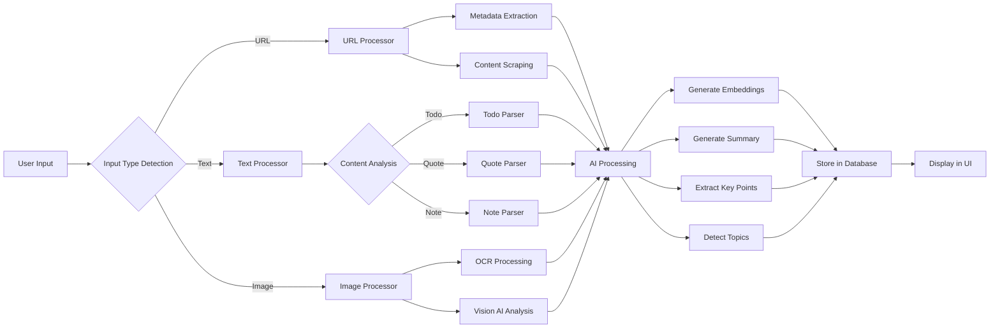

# 🧠 Synapse - Your Second Brain

<div align="center">

**An intelligent personal knowledge management system that captures, organizes, and helps you search through everything you save.**

[](https://nextjs.org/)
[](https://www.typescriptlang.org/)
[](https://opensource.org/licenses/MIT)

[Features](#-features) • [Quick Start](#-quick-start) • [Documentation](#-documentation) • [Architecture](#-architecture) • [Deployment](#-deployment)

</div>

---

## 📖 Table of Contents

- [Overview](#-overview)
- [Features](#-features)
- [Tech Stack](#-tech-stack)
- [Quick Start](#-quick-start)
- [Project Structure](#-project-structure)
- [How It Works](#-how-it-works)
- [API Documentation](#-api-documentation)
- [Browser Extension](#-browser-extension)
- [MCP Server Integration](#-mcp-server-integration)
- [Configuration](#-configuration)
- [Deployment](#-deployment)
- [Development Guide](#-development-guide)
- [Troubleshooting](#-troubleshooting)
- [Contributing](#-contributing)
- [License](#-license)

---

## 🌟 Overview

Synapse is a comprehensive **second brain** application designed to help you capture, organize, and retrieve information effortlessly. Whether it's articles, videos, images, todos, quotes, or notes - Synapse intelligently processes and stores everything with AI-powered semantic search.

### Why Synapse?

- 🚀 **Instant Capture**: Save anything with a single click
- 🤖 **AI-Powered**: Automatic content analysis, summaries, and semantic search
- 🎨 **Beautiful UI**: Modern, intuitive interface with content-specific cards
- 🔒 **Privacy-First**: Self-hosted with encrypted sessions
- 🔌 **Extensible**: Browser extension, MCP server, and API access
- 📱 **Responsive**: Works seamlessly across all devices

---

## ✨ Features

### Content Capture & Processing

#### 📰 **Articles**
- Automatic metadata extraction (title, author, description, favicon)
- Reading time estimation
- Clean, readable content extraction using Readability.js
- AI-generated summaries and key points
- Topic detection and tagging

#### 🎥 **YouTube Videos**
- Embedded video player with thumbnail
- Automatic transcript extraction
- Video duration and channel information
- AI-powered video summaries
- Key moments extraction

#### 🛍️ **Products**
- Price tracking and display
- Product images and descriptions
- Metadata extraction from e-commerce sites
- Shopping list organization

#### ✅ **Todo Lists**
- Interactive checkboxes
- Progress tracking
- Markdown-style syntax support
- Quick task management

#### 💬 **Quotes**
- Beautiful quote styling
- Attribution tracking
- Quick reference and inspiration

#### 🖼️ **Images**
- OCR text extraction using Tesseract.js
- AI vision analysis for scene understanding
- Full-resolution storage
- Caption and description generation

#### 📝 **Notes**
- Rich text support
- Quick capture for thoughts and ideas
- Automatic timestamping

### Search & Discovery

#### 🔍 **Semantic Search**
- Natural language queries
- AI-powered embeddings using Groq
- Cosine similarity ranking
- Keyword boosting for precision
- Multi-modal search (text + images)

#### 🏷️ **Smart Collections**
- Auto-generated topic collections
- Manual collection creation
- Color-coded organization
- Batch item management

### AI Features

- **Summarization**: Automatic content summaries
- **Key Points Extraction**: Bullet-point highlights
- **Topic Detection**: Automatic categorization
- **Search Tags**: AI-generated searchable tags
- **Vision Analysis**: Image understanding and captioning

### Authentication & Security

- 🔐 Secure session management with `iron-session`
- 🔑 Password hashing with `bcrypt`
- 🎫 API key authentication for MCP server
- 🛡️ CSRF protection
- 📊 User isolation (data privacy)

---

## 🛠️ Tech Stack

### Frontend
- **Framework**: Next.js 14 with App Router
- **Language**: TypeScript 5.0
- **Styling**: Tailwind CSS
- **UI Components**: Custom React components
- **Icons**: Lucide React

### Backend
- **Runtime**: Node.js 18+
- **API**: Next.js API Routes
- **Database**: SQLite with `better-sqlite3`
- **Session**: `iron-session` for secure sessions
- **Authentication**: Custom implementation with bcrypt

### AI & Processing
- **LLM**: Groq API (Llama 3.1 70B)
- **Embeddings**: Groq API (multilingual-e5-large)
- **OCR**: Tesseract.js
- **Content Extraction**: Readability.js, JSDOM
- **Web Scraping**: Cheerio
- **YouTube**: youtube-transcript

### Browser Extension
- **Manifest**: V3
- **Background**: Service Worker
- **Content Scripts**: Dynamic injection
- **Popup**: React with Tailwind CSS

### MCP Server
- **Framework**: Express.js
- **Protocol**: Model Context Protocol (MCP)
- **Transport**: stdio
- **Features**: Read, search, create items

---

## 🚀 Quick Start

### Prerequisites

- **Node.js**: 18.0 or higher
- **npm**: 9.0 or higher
- **Groq API Key**: Get one at [groq.com](https://console.groq.com/)

### Installation

```bash
# Clone the repository
git clone https://github.com/yourusername/synapse.git
cd synapse

# Install dependencies
npm install

# Create environment file
cp .env.example .env
```

### Environment Configuration

Create a `.env` file in the root directory:

```bash
# Required: Groq API key for AI features
GROQ_API_KEY=your_groq_api_key_here

# Required: Secret for session encryption (min 32 characters)
SESSION_SECRET=your_random_secret_at_least_32_characters_long

# Optional: Disable telemetry
NEXT_TELEMETRY_DISABLED=1
```

### Running the Application

```bash
# Development mode (with hot reload)
npm run dev

# Production build
npm run build
npm start

# Linting
npm run lint
```

Open [http://localhost:3000](http://localhost:3000) in your browser.

### First Steps

1. **Sign Up**: Create your account at `/auth/signup`
2. **Add Content**: Click "Add to Synapse" button
3. **Try Examples**:
   ```
   # Article
   https://example.com/article
   
   # YouTube Video
   https://youtube.com/watch?v=dQw4w9WgXcQ
   
   # Todo List
   - Buy groceries
   - Call dentist
   - Finish report
   
   # Quote
   "The only way to do great work is to love what you do" - Steve Jobs
   
   # Note
   Just type anything!
   ```
4. **Search**: Use natural language:
   - "articles about AI"
   - "my todo lists from last week"
   - "products under $500"
   - "quotes about productivity"

---

## 📂 Project Structure

```
synapse/
├── app/                          # Next.js App Router
│   ├── api/                      # API Routes
│   │   ├── auth/                 # Authentication
│   │   │   ├── login/route.ts    # Login endpoint
│   │   │   ├── logout/route.ts   # Logout endpoint
│   │   │   └── signup/route.ts   # Signup endpoint
│   │   ├── items/                # Items CRUD
│   │   │   ├── route.ts          # List/Create items
│   │   │   └── [id]/route.ts     # Update/Delete item
│   │   ├── search/route.ts       # Semantic search
│   │   ├── collections/route.ts  # Collections management
│   │   ├── analytics/route.ts    # Usage analytics
│   │   └── api-keys/route.ts     # API key management
│   ├── auth/                     # Auth pages
│   │   ├── login/page.tsx        # Login UI
│   │   └── signup/page.tsx       # Signup UI
│   ├── dashboard/                # Main app
│   │   └── page.tsx              # Dashboard UI
│   ├── collections/              # Collections view
│   │   └── page.tsx              # Collections UI
│   ├── layout.tsx                # Root layout
│   ├── page.tsx                  # Landing page
│   └── globals.css               # Global styles
│
├── components/                   # React Components
│   ├── cards/                    # Content type cards
│   │   ├── ArticleCard.tsx       # Article display
│   │   ├── YouTubeCard.tsx       # YouTube player
│   │   ├── ProductCard.tsx       # Product display
│   │   ├── TodoCard.tsx          # Todo list
│   │   ├── QuoteCard.tsx         # Quote styling
│   │   ├── ImageCard.tsx         # Image with OCR
│   │   ├── NoteCard.tsx          # Simple note
│   │   └── ContentCard.tsx       # Card router
│   ├── AddItemModal.tsx          # Add content modal
│   ├── SearchBar.tsx             # Search interface
│   ├── CollectionView.tsx        # Collection display
│   └── Header.tsx                # App header
│
├── lib/                          # Core Libraries
│   ├── ai.ts                     # Groq AI integration
│   ├── auth.ts                   # Auth utilities
│   ├── db.ts                     # SQLite database
│   ├── session.ts                # Session management
│   ├── processor.ts              # Content processing
│   ├── scraper.ts                # URL metadata extraction
│   ├── ocr.ts                    # Image text extraction
│   ├── vision-ai.ts              # Image analysis
│   ├── youtube.ts                # YouTube processing
│   └── types.ts                  # TypeScript types
│
├── browser-extension/            # Chrome Extension
│   ├── manifest.json             # Extension manifest
│   ├── popup.html                # Extension popup
│   ├── background.js             # Service worker
│   └── content.js                # Content script
│
├── mcp-server/                   # MCP Server
│   ├── index.ts                  # MCP implementation
│   ├── package.json              # MCP dependencies
│   └── tsconfig.json             # TypeScript config
│
├── public/                       # Static assets
│   ├── icon-128.png              # App icon
│   └── ...
│
├── database.db                   # SQLite database (created on first run)
├── next.config.js                # Next.js configuration
├── tailwind.config.ts            # Tailwind configuration
├── tsconfig.json                 # TypeScript configuration
├── package.json                  # Dependencies
└── .env                          # Environment variables
```

---

## 🔧 How It Works

### Content Processing Pipeline



### 1. Input Detection (`lib/processor.ts`)

The system automatically detects what type of content you're adding:

```typescript
export function detectInputType(input: string): InputType {
  // URL detection
  if (input.startsWith('http://') || input.startsWith('https://')) {
    if (input.includes('youtube.com') || input.includes('youtu.be')) {
      return 'youtube';
    }
    return 'url';
  }
  
  // Image data URL
  if (input.startsWith('data:image/')) {
    return 'image';
  }
  
  // Text patterns
  if (input.includes('\n- ') || input.includes('\n* ')) {
    return 'todo';
  }
  
  if (input.startsWith('"') && input.includes('" -')) {
    return 'quote';
  }
  
  return 'note';
}
```

### 2. Content Extraction

#### Article Processing (`lib/scraper.ts`)
- Fetches HTML content
- Extracts Open Graph metadata
- Uses Readability.js for clean content
- Calculates reading time
- Extracts author and publication date

#### YouTube Processing (`lib/youtube.ts`)
- Extracts video ID from URL
- Fetches video metadata
- Downloads transcript if available
- Extracts thumbnail and duration

#### Image Processing (`lib/ocr.ts` + `lib/vision-ai.ts`)
- Runs OCR using Tesseract.js
- Analyzes scene with AI vision
- Extracts text and descriptions
- Generates searchable tags

### 3. AI Enhancement (`lib/ai.ts`)

All content is enhanced with AI:

```typescript
// Generate embedding for semantic search
const embedding = await generateEmbedding(content);

// Generate summary
const summary = await generateSummary(content);

// Extract key points
const keyPoints = await extractKeyPoints(content);

// Detect topics
const topics = await detectTopics(content);
```

**AI Models Used:**
- **LLM**: `llama-3.1-70b-versatile` (summarization, analysis)
- **Embeddings**: `multilingual-e5-large` (semantic search)

### 4. Storage (`lib/db.ts`)

Data is stored in SQLite with this schema:

```sql
-- Users table
CREATE TABLE users (
  id INTEGER PRIMARY KEY AUTOINCREMENT,
  email TEXT UNIQUE NOT NULL,
  password_hash TEXT NOT NULL,
  created_at DATETIME DEFAULT CURRENT_TIMESTAMP
);

-- Items table (main content storage)
CREATE TABLE items (
  id INTEGER PRIMARY KEY AUTOINCREMENT,
  user_id INTEGER NOT NULL,
  type TEXT NOT NULL,  -- article, youtube, product, todo, quote, image, note
  title TEXT NOT NULL,
  content TEXT,
  metadata_json TEXT,  -- JSON blob with type-specific metadata
  embedding_vector TEXT,  -- AI embedding for semantic search
  created_at DATETIME DEFAULT CURRENT_TIMESTAMP,
  FOREIGN KEY (user_id) REFERENCES users(id) ON DELETE CASCADE
);

-- Collections table
CREATE TABLE collections (
  id INTEGER PRIMARY KEY AUTOINCREMENT,
  user_id INTEGER NOT NULL,
  name TEXT NOT NULL,
  description TEXT,
  color TEXT,
  icon TEXT,
  auto_generated BOOLEAN DEFAULT FALSE,
  created_at DATETIME DEFAULT CURRENT_TIMESTAMP,
  FOREIGN KEY (user_id) REFERENCES users(id) ON DELETE CASCADE
);

-- Collection items junction
CREATE TABLE collection_items (
  collection_id INTEGER NOT NULL,
  item_id INTEGER NOT NULL,
  added_at DATETIME DEFAULT CURRENT_TIMESTAMP,
  PRIMARY KEY (collection_id, item_id),
  FOREIGN KEY (collection_id) REFERENCES collections(id) ON DELETE CASCADE,
  FOREIGN KEY (item_id) REFERENCES items(id) ON DELETE CASCADE
);

-- API keys for MCP server
CREATE TABLE api_keys (
  id INTEGER PRIMARY KEY AUTOINCREMENT,
  user_id INTEGER NOT NULL,
  key_hash TEXT UNIQUE NOT NULL,
  name TEXT NOT NULL,
  created_at DATETIME DEFAULT CURRENT_TIMESTAMP,
  last_used_at DATETIME,
  FOREIGN KEY (user_id) REFERENCES users(id) ON DELETE CASCADE
);
```

### 5. Semantic Search (`lib/ai.ts`)

Search uses hybrid approach:

1. **Embedding Similarity**: Query → Embedding → Cosine similarity
2. **Keyword Matching**: Direct text matching with boosting
3. **Ranking**: Combines both scores for final results

```typescript
export async function semanticSearch(
  query: string,
  userId: number,
  limit: number = 10
): Promise<SearchResult[]> {
  // Generate query embedding
  const queryEmbedding = await generateEmbedding(query);
  
  // Get all user items
  const items = itemDb.getUserItems(userId);
  
  // Calculate similarity scores
  const results = items.map(item => {
    const similarity = cosineSimilarity(
      queryEmbedding,
      JSON.parse(item.embedding_vector)
    );
    
    // Boost with keyword matching
    const keywordScore = calculateKeywordScore(query, item);
    const finalScore = (similarity * 0.7) + (keywordScore * 0.3);
    
    return { item, score: finalScore };
  });
  
  // Sort and return top results
  return results
    .sort((a, b) => b.score - a.score)
    .slice(0, limit);
}
```

---

## 📡 API Documentation

### Authentication

All API routes (except auth endpoints) require authentication via session or API key.

#### Sign Up
```http
POST /api/auth/signup
Content-Type: application/json

{
  "email": "user@example.com",
  "password": "securepassword123"
}
```

#### Login
```http
POST /api/auth/login
Content-Type: application/json

{
  "email": "user@example.com",
  "password": "securepassword123"
}
```

#### Logout
```http
POST /api/auth/logout
```

### Items

#### Create Item
```http
POST /api/items
Content-Type: application/json
Authorization: Bearer YOUR_API_KEY (optional)

{
  "input": "https://example.com/article",
  "type": "url"  // auto-detected if not provided
}
```

#### Get All Items
```http
GET /api/items?type=article&limit=20&offset=0
```

#### Get Single Item
```http
GET /api/items/123
```

#### Update Item
```http
PUT /api/items/123
Content-Type: application/json

{
  "title": "Updated Title",
  "content": "Updated content"
}
```

#### Delete Item
```http
DELETE /api/items/123
```

### Search

#### Semantic Search
```http
POST /api/search
Content-Type: application/json

{
  "query": "articles about artificial intelligence",
  "limit": 10
}
```

Response:
```json
{
  "results": [
    {
      "item": {
        "id": 1,
        "type": "article",
        "title": "Introduction to AI",
        "content": "...",
        "metadata": { ... },
        "created_at": "2024-01-01T00:00:00Z"
      },
      "score": 0.87
    }
  ]
}
```

### Collections

#### Create Collection
```http
POST /api/collections
Content-Type: application/json

{
  "name": "Reading List",
  "description": "Articles to read",
  "color": "#3b82f6",
  "icon": "book"
}
```

#### Add Item to Collection
```http
POST /api/collections/123/items
Content-Type: application/json

{
  "itemId": 456
}
```

### API Keys

#### Create API Key
```http
POST /api/api-keys
Content-Type: application/json

{
  "name": "MCP Server Key"
}
```

Response:
```json
{
  "apiKey": "syn_1234567890abcdef",
  "name": "MCP Server Key"
}
```

**⚠️ Important**: Save the API key immediately. It's only shown once!

---

## 🔌 Browser Extension

The Synapse browser extension allows you to save content with a single click.

### Installation

1. **Build the extension**:
```bash
cd browser-extension
npm install
npm run build
```

2. **Load in Chrome**:
   - Open `chrome://extensions/`
   - Enable "Developer mode"
   - Click "Load unpacked"
   - Select the `browser-extension` folder

### Features

- 🌐 **Save Current Page**: Click the extension icon
- ✂️ **Save Selected Text**: Highlight text → Right-click → "Save to Synapse"
- 🖼️ **Save Images**: Right-click image → "Save to Synapse"
- 📋 **Keyboard Shortcut**: `Ctrl+Shift+S` (Windows) or `Cmd+Shift+S` (Mac)

### Configuration

Click the extension icon and enter:
- **Synapse URL**: Your Synapse instance URL (e.g., `http://localhost:3000`)
- **API Key**: Generated from dashboard

### Code Overview

```javascript
// browser-extension/background.js
chrome.runtime.onInstalled.addListener(() => {
  // Create context menu items
  chrome.contextMenus.create({
    id: 'save-to-synapse',
    title: 'Save to Synapse',
    contexts: ['page', 'selection', 'image', 'link']
  });
});

// Handle context menu clicks
chrome.contextMenus.onClicked.addListener(async (info, tab) => {
  const { synapse_url, api_key } = await chrome.storage.sync.get([
    'synapse_url',
    'api_key'
  ]);
  
  // Send to Synapse API
  await fetch(`${synapse_url}/api/items`, {
    method: 'POST',
    headers: {
      'Content-Type': 'application/json',
      'Authorization': `Bearer ${api_key}`
    },
    body: JSON.stringify({
      input: info.pageUrl || info.selectionText || info.srcUrl
    })
  });
});
```

---

## 🤖 MCP Server Integration

The MCP (Model Context Protocol) server allows AI assistants like Claude to interact with your Synapse data.

### What is MCP?

MCP is a protocol that enables AI assistants to:
- Read your saved content
- Search through your knowledge base
- Create new items
- Use your data as context for responses

### Setup

1. **Generate API Key**:
   - Go to Synapse Dashboard
   - Navigate to Settings → API Keys
   - Create new key for MCP server

2. **Configure Claude Desktop**:

Edit `~/Library/Application Support/Claude/claude_desktop_config.json` (Mac) or `%APPDATA%\Claude\claude_desktop_config.json` (Windows):

```json
{
  "mcpServers": {
    "synapse": {
      "command": "node",
      "args": [
        "D:/Synapse/mcp-server/index.js"
      ],
      "env": {
        "SYNAPSE_API_URL": "http://localhost:3000",
        "SYNAPSE_API_KEY": "syn_your_api_key_here"
      }
    }
  }
}
```

3. **Restart Claude Desktop**

### Usage

Once configured, you can ask Claude:

- "Show me all my saved articles about AI"
- "What are my recent todo lists?"
- "Search my notes for information about React hooks"
- "Save this article to my knowledge base"

### MCP Tools Available

```typescript
// Read Items
{
  name: "read_items",
  description: "Read all items from Synapse",
  inputSchema: {
    type: "object",
    properties: {
      limit: { type: "number", description: "Max items to return" },
      type: { type: "string", description: "Filter by type" }
    }
  }
}

// Search Items
{
  name: "search_items",
  description: "Semantic search through items",
  inputSchema: {
    type: "object",
    properties: {
      query: { type: "string", description: "Search query" },
      limit: { type: "number", description: "Max results" }
    },
    required: ["query"]
  }
}

// Create Item
{
  name: "create_item",
  description: "Add new item to Synapse",
  inputSchema: {
    type: "object",
    properties: {
      input: { type: "string", description: "Content to save" },
      type: { type: "string", description: "Content type" }
    },
    required: ["input"]
  }
}
```

---

## ⚙️ Configuration

### Environment Variables

| Variable | Required | Default | Description |
|----------|----------|---------|-------------|
| `GROQ_API_KEY` | ✅ Yes | - | Groq API key for AI features |
| `SESSION_SECRET` | ✅ Yes | - | Secret for session encryption (32+ chars) |
| `NEXT_TELEMETRY_DISABLED` | ❌ No | `0` | Disable Next.js telemetry |
| `NODE_ENV` | ❌ No | `development` | Environment mode |
| `PORT` | ❌ No | `3000` | Server port |

### Next.js Configuration

```javascript
// next.config.js
module.exports = {
  images: {
    remotePatterns: [
      {
        protocol: 'https',
        hostname: '**',
      },
    ],
  },
  
  webpack: (config, { isServer }) => {
    if (isServer) {
      config.externals.push('better-sqlite3');
    }
    return config;
  },
  
  experimental: {
    serverComponentsExternalPackages: [
      'tesseract.js',
      'better-sqlite3',
      'youtube-transcript'
    ],
  },
};
```

### Database Configuration

The SQLite database is automatically created on first run. Location:
- **Development**: `./database.db`
- **Production (Railway)**: `/app/data/database.db` (persistent volume)

To customize:
```typescript
// lib/db.ts
const dataDir = process.env.RAILWAY_VOLUME_MOUNT_PATH || process.cwd();
const dbPath = path.join(dataDir, 'database.db');
```

---

## 🚀 Deployment

### Railway (Recommended)

Railway provides persistent storage for SQLite, making it ideal for Synapse.

#### Prerequisites
- Railway account
- GitHub repository

#### Steps

1. **Create New Project**:
   - Go to [railway.app](https://railway.app)
   - Click "New Project" → "Deploy from GitHub repo"
   - Select your Synapse repository

2. **Add Persistent Volume**:
   - Go to project settings
   - Add volume: `/app/data`
   - This ensures your database persists across deployments

3. **Set Environment Variables**:
```bash
GROQ_API_KEY=your_groq_api_key
SESSION_SECRET=your_random_32_char_secret
NODE_ENV=production
NEXT_TELEMETRY_DISABLED=1
```

4. **Deploy**:
   - Railway automatically detects Next.js
   - Build command: `npm run build`
   - Start command: `npm start`
   - Domain: Auto-generated or custom

#### Railway Configuration

Create `railway.json`:
```json
{
  "$schema": "https://railway.app/railway.schema.json",
  "build": {
    "builder": "NIXPACKS"
  },
  "deploy": {
    "startCommand": "npm start",
    "restartPolicyType": "ON_FAILURE",
    "restartPolicyMaxRetries": 10
  }
}
```

### Vercel (⚠️ Not Recommended for SQLite)

Vercel uses serverless architecture which doesn't support persistent SQLite. If you want to deploy on Vercel, you'll need to:

1. Switch to a cloud database (PostgreSQL, MySQL)
2. Update `lib/db.ts` to use Prisma or another ORM
3. Configure database connection in Vercel environment variables

### Docker

```dockerfile
# Dockerfile
FROM node:18-alpine

WORKDIR /app

# Install dependencies
COPY package*.json ./
RUN npm ci --only=production

# Copy source
COPY . .

# Build
RUN npm run build

# Create data directory for SQLite
RUN mkdir -p /app/data

# Expose port
EXPOSE 3000

# Start
CMD ["npm", "start"]
```

Build and run:
```bash
docker build -t synapse .
docker run -p 3000:3000 \
  -e GROQ_API_KEY=your_key \
  -e SESSION_SECRET=your_secret \
  -v synapse-data:/app/data \
  synapse
```

### VPS (Linux Server)

```bash
# Install Node.js
curl -fsSL https://deb.nodesource.com/setup_18.x | sudo -E bash -
sudo apt-get install -y nodejs

# Clone and setup
git clone https://github.com/yourusername/synapse.git
cd synapse
npm install
npm run build

# Create .env file
cat > .env << EOF
GROQ_API_KEY=your_groq_api_key
SESSION_SECRET=your_random_secret
NODE_ENV=production
EOF

# Use PM2 for process management
sudo npm install -g pm2
pm2 start npm --name synapse -- start
pm2 startup
pm2 save

# Setup nginx reverse proxy
sudo apt-get install nginx
sudo nano /etc/nginx/sites-available/synapse
```

Nginx configuration:
```nginx
server {
    listen 80;
    server_name your-domain.com;

    location / {
        proxy_pass http://localhost:3000;
        proxy_http_version 1.1;
        proxy_set_header Upgrade $http_upgrade;
        proxy_set_header Connection 'upgrade';
        proxy_set_header Host $host;
        proxy_cache_bypass $http_upgrade;
    }
}
```

---

## 👨‍💻 Development Guide

### Getting Started

```bash
# Clone repository
git clone https://github.com/yourusername/synapse.git
cd synapse

# Install dependencies
npm install

# Setup environment
cp .env.example .env
# Edit .env with your API keys

# Run development server
npm run dev
```

### Project Commands

```bash
# Development
npm run dev              # Start dev server
npm run build            # Production build
npm run start            # Start production server
npm run lint             # Run ESLint
npm run type-check       # TypeScript check

# Database
npm run db:reset         # Reset database (coming soon)
npm run db:migrate       # Run migrations (coming soon)

# Testing
npm run test             # Run tests (coming soon)
npm run test:e2e         # E2E tests (coming soon)
```

### Adding a New Content Type

1. **Create Card Component**:

```typescript
// components/cards/PodcastCard.tsx
export function PodcastCard({ item, onDelete }: PodcastCardProps) {
  const metadata = item.metadata as PodcastMetadata;
  
  return (
    <div className="card">
      <h3>{item.title}</h3>
      <audio controls src={metadata.audioUrl} />
      {/* ... */}
    </div>
  );
}
```

2. **Add Type Detection**:

```typescript
// lib/processor.ts
export function detectInputType(input: string): InputType {
  // ... existing detections
  
  if (input.includes('podcast') || input.endsWith('.mp3')) {
    return 'podcast';
  }
  
  return 'note';
}
```

3. **Add Processor**:

```typescript
// lib/processor.ts
async function processPodcast(url: string): Promise<ProcessedContent> {
  // Extract podcast metadata
  const metadata = await extractPodcastMetadata(url);
  
  // Generate AI insights
  const aiInsights = await generateAIInsights(metadata.description);
  
  return {
    type: 'podcast',
    title: metadata.title,
    content: metadata.description,
    metadata: {
      audioUrl: url,
      duration: metadata.duration,
      ...aiInsights
    }
  };
}
```

4. **Update ContentCard Router**:

```typescript
// components/cards/ContentCard.tsx
export function ContentCard({ item, onDelete }: ContentCardProps) {
  switch (item.type) {
    // ... existing cases
    case 'podcast':
      return <PodcastCard item={item} onDelete={onDelete} />;
    default:
      return <NoteCard item={item} onDelete={onDelete} />;
  }
}
```

### Code Style

- **TypeScript**: Strict mode enabled
- **Formatting**: Prettier (2 spaces, single quotes)
- **Linting**: ESLint with Next.js rules
- **Commits**: Conventional commits format

```bash
# Commit format
feat: add podcast support
fix: resolve OCR memory leak
docs: update README
refactor: simplify search algorithm
```

---

## 🐛 Troubleshooting

### Build Errors

#### `Error: Module not found: Can't resolve 'better-sqlite3'`

**Solution**: Add to `next.config.js`:
```javascript
webpack: (config, { isServer }) => {
  if (isServer) {
    config.externals.push('better-sqlite3');
  }
  return config;
}
```

#### `ReferenceError: File is not defined`

**Solution**: Add to API route:
```typescript
export const dynamic = 'force-dynamic';
export const runtime = 'nodejs';
```

### Runtime Errors

#### `The GROQ_API_KEY environment variable is missing`

**Solution**: Ensure `.env` file exists with:
```bash
GROQ_API_KEY=your_actual_key
```

#### `Database locked`

**Solution**: Enable WAL mode (already configured):
```typescript
db.pragma('journal_mode = WAL');
```

#### `OCR not working`

**Solution**: Tesseract.js needs worker files. They're automatically downloaded but may fail in some environments. Check:
- Network connectivity
- Disk space
- File permissions in `/tmp` or temp directory

### Deployment Issues

#### Railway: "Failed to build"

**Solutions**:
1. Check environment variables are set
2. Ensure volume is mounted at `/app/data`
3. Review build logs for specific errors
4. Try adding: `NEXT_SKIP_VALIDATION=1`

#### Railway: "Database not persisting"

**Solution**: Verify volume mount:
- Go to Railway dashboard
- Project settings → Volumes
- Ensure mount path is `/app/data`
- Redeploy after adding volume

### Extension Issues

#### "Failed to save to Synapse"

**Solutions**:
1. Verify API URL is correct
2. Check API key is valid
3. Ensure CORS is enabled (should be by default)
4. Check browser console for errors

### MCP Server Issues

#### "MCP server not connecting"

**Solutions**:
1. Verify `claude_desktop_config.json` path is correct
2. Check API key is valid
3. Ensure Synapse is running
4. Restart Claude Desktop after config changes

---

## 🤝 Contributing

Contributions are welcome! Here's how you can help:

### Reporting Bugs

1. Check existing issues
2. Create new issue with:
   - Clear title
   - Steps to reproduce
   - Expected vs actual behavior
   - Screenshots if applicable
   - Environment details

### Feature Requests

1. Check if already requested
2. Describe the feature clearly
3. Explain use case
4. Provide examples if possible

### Pull Requests

1. Fork the repository
2. Create feature branch: `git checkout -b feature/amazing-feature`
3. Commit changes: `git commit -m 'feat: add amazing feature'`
4. Push to branch: `git push origin feature/amazing-feature`
5. Open pull request

#### PR Guidelines

- Follow existing code style
- Add tests for new features
- Update documentation
- Keep commits atomic and well-described
- Ensure all tests pass

---

## 📄 License

This project is licensed under the MIT License - see the [LICENSE](LICENSE) file for details.

```
MIT License

Copyright (c) 2024 Synapse

Permission is hereby granted, free of charge, to any person obtaining a copy
of this software and associated documentation files (the "Software"), to deal
in the Software without restriction, including without limitation the rights
to use, copy, modify, merge, publish, distribute, sublicense, and/or sell
copies of the Software, and to permit persons to whom the Software is
furnished to do so, subject to the following conditions:

The above copyright notice and this permission notice shall be included in all
copies or substantial portions of the Software.

THE SOFTWARE IS PROVIDED "AS IS", WITHOUT WARRANTY OF ANY KIND, EXPRESS OR
IMPLIED, INCLUDING BUT NOT LIMITED TO THE WARRANTIES OF MERCHANTABILITY,
FITNESS FOR A PARTICULAR PURPOSE AND NONINFRINGEMENT. IN NO EVENT SHALL THE
AUTHORS OR COPYRIGHT HOLDERS BE LIABLE FOR ANY CLAIM, DAMAGES OR OTHER
LIABILITY, WHETHER IN AN ACTION OF CONTRACT, TORT OR OTHERWISE, ARISING FROM,
OUT OF OR IN CONNECTION WITH THE SOFTWARE OR THE USE OR OTHER DEALINGS IN THE
SOFTWARE.
```

---

## 🙏 Acknowledgments

- **Next.js** - React framework
- **Groq** - Fast AI inference
- **Tesseract.js** - OCR processing
- **Readability.js** - Content extraction
- **Tailwind CSS** - Styling framework
- **Lucide** - Beautiful icons
- **Model Context Protocol** - AI assistant integration

---

## 📞 Support

- **Documentation**: This README
- **Issues**: [GitHub Issues](https://github.com/yourusername/synapse/issues)
- **Discussions**: [GitHub Discussions](https://github.com/yourusername/synapse/discussions)
- **Email**: support@synapse.example.com

---

## 🗺️ Roadmap

### Version 1.1 (Current Focus)
- [ ] Mobile responsive improvements
- [ ] Dark mode
- [ ] Export/import functionality
- [ ] Bulk operations

### Version 1.2
- [ ] Full-text search with highlights
- [ ] Advanced filtering
- [ ] Tags and labels
- [ ] Shared collections

### Version 2.0
- [ ] Multi-user collaboration
- [ ] Real-time sync
- [ ] Mobile apps (iOS/Android)
- [ ] Self-hosted AI models option

### Version 3.0
- [ ] Browser history integration
- [ ] Email integration
- [ ] Calendar integration
- [ ] Advanced analytics dashboard

---

<div align="center">

**Built with ❤️ by the Synapse team**

[⭐ Star on GitHub](https://github.com/yourusername/synapse) • [🐛 Report Bug](https://github.com/yourusername/synapse/issues) • [💡 Request Feature](https://github.com/yourusername/synapse/issues)

</div>
